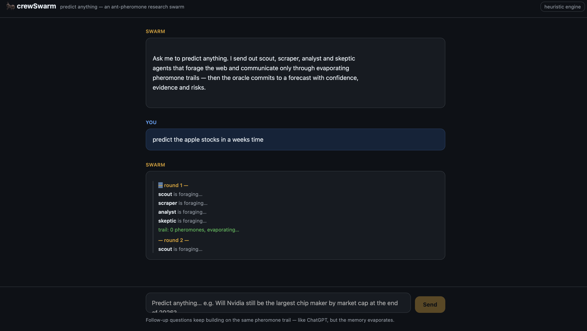
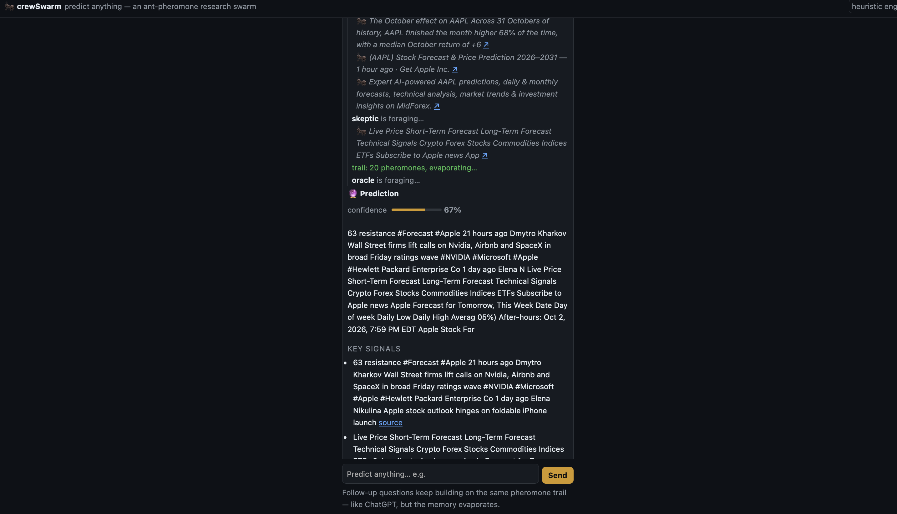

# crewSwarm 🐜 — predict anything

A multi-agent research swarm in the spirit of [MiroFish](https://mirofish.homes),
with an ant-colony twist: agents forage the web and communicate **only**
through short, evaporating pheromone trails — no agent ever sees another
agent's full transcript.

Chat with it like ChatGPT: ask it to predict anything, watch the colony
forage live, and keep asking follow-ups on the same trail.





## The swarm

| Agent    | Role                                                                 |
|----------|----------------------------------------------------------------------|
| scout    | searches the web, lays link pheromones                               |
| scraper  | follows the strongest link trails, drags page content back           |
| analyst  | distills content into signal pheromones                              |
| skeptic  | marks risky / contradicted trails                                    |
| oracle   | reads the whole board once, commits to a prediction with confidence  |

**Sparse information sharing.** Each forager can only *sniff* the top few
pheromones its role is tuned for (`backend/app/pheromones.py` → `ROLE_SCENTS`),
ranked by strength. **Evaporation.** Every round all pheromones decay and
fully-faded bits are pruned, so only reinforced information survives —
exactly how ant trails work.

## Run it

```bash
./run.sh          # → http://127.0.0.1:8000
```

No API key needed — the default **heuristic engine** does real web search and
scraping with rule-based analysis.

### Optional: LLM-driven agents via CrewAI

```bash
.venv/bin/pip install crewai
export OPENAI_API_KEY=sk-...
./run.sh
```

With a key set and crewai importable, the same pheromone loop is driven by
CrewAI agents (classic Agent/Task/Crew API, `backend/app/llm_adapter.py`) —
each agent still only perceives the board through the `sniff_trail` tool.
If the LLM fails at any step, the colony falls back gracefully.

The UI has an engine selector (top right): **auto** picks LLM when
available and heuristic otherwise, or you can force either one. Forcing LLM
without a key streams a notice and falls back to the heuristic engine for
that run only.

## Layout

```
backend/app/
  pheromones.py   the shared trail: deposit / sniff / evaporate
  tools.py        keyless search (ddgs + DDG HTML fallback) and scraping
  engine.py       the swarm loop + heuristic oracle
  llm_adapter.py  CrewAI mode (optional)
  main.py         FastAPI, SSE streaming
frontend/
  index.html      ChatGPT-style UI, streams the colony live
```

## API

- `GET  /api/predict/stream?q=...&session_id=...&mode=auto|heuristic|llm` — SSE event stream
- `POST /api/predict` `{question, session_id?, mode?}` — one-shot JSON
- `GET  /api/board/{session_id}` — inspect the pheromone board
- `GET  /api/health` — crewai availability + reason

A `session_id` is a pheromone board: follow-up questions keep foraging on
the same evaporating trail.
